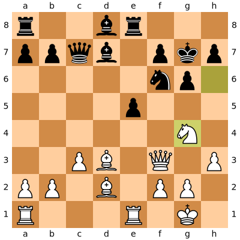
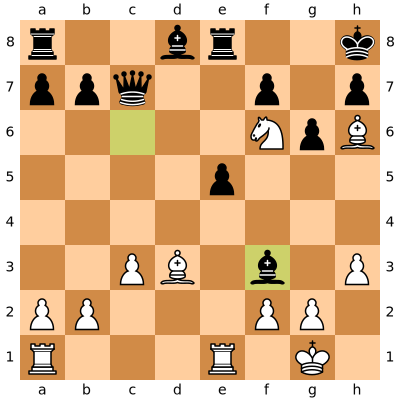
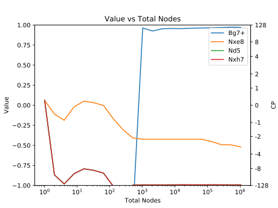
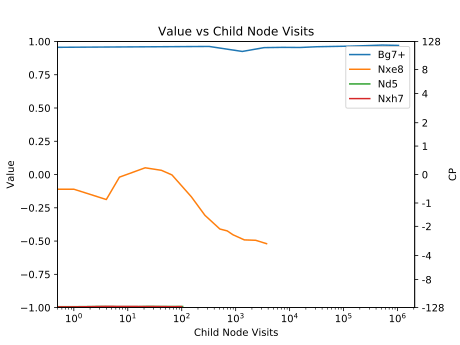
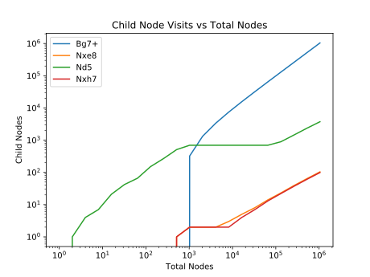
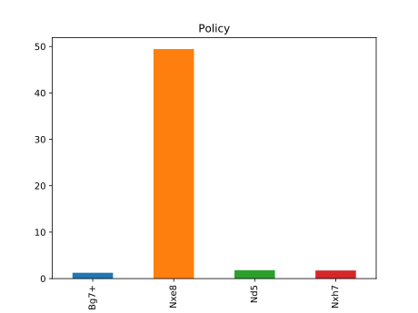

lc0_analyzer.py takes pgn files or FEN strings, analyzes them with the Lc0 chess engine, and outputs some graphs to visualize Lc0's search. For each position, several graphs are created:
* Value vs Total Nodes - Shows how the value of the moves change over time (Total Nodes searched).
* Value vs Child Node Visits - Show how the value of the top moves change, but assuming equal time (Child Node Visits) is given to each candidate move.
* Child Node Visits vs Total Nodes - Shows how much total time (visits) each move is searched.
* Policy - Output of Lc0's NN Policy head.

Example position

Black to play, Lc0 doesn't realize Bc6 is a losing move. To see the problem, let's look at the position a few moves later with White to play:

After 1K nodes, Lc0 realizes Bg7+ wins.

This graph shows Lc0 knows Bg7+ is winning the moment is starts searching it.

Once Lc0 finds the winning Bg7+, it quickly gets all the search time.

The problem is Bg7+ has low Policy, so the search ignores it for a long time.

A giant image of all positions:

